---
header-includes:
  - \usepackage{longtable}
  - \usepackage{booktabs}
  - \usepackage{adjustbox}
  - \let\oldlongtable\longtable
  - \renewcommand{\longtable}{\small\oldlongtable}
  - \usepackage{geometry}
  - \geometry{margin=0.75in}
---

# LZ78 Tokenization Ablation Study — Experiment Report

**Date**: February 18, 2026
**Project**: nanochat
**Authors**: Parsa Idehpour

---

## 1. Overview

This report documents a systematic ablation study comparing **LZ78-family tokenizers** against **BPE (Byte-Pair Encoding)** for language model training. We evaluate how tokenizer type, token embedding strategy, and loss function affect model quality, measured in **bits-per-byte (BPB)** — a vocab-size-independent metric enabling fair comparison across tokenizers with different vocabulary sizes.

**Key research questions:**
1. Can LZ78-based tokenizers match BPE performance for LM training?
2. Does exploiting the tree structure of LZ78 tokens (via structured embeddings) help?
3. Can prefix-aware soft labels improve training by giving partial credit to prefix tokens?

---

## 2. Experimental Setup

### 2.1 Model Architecture

All experiments use the same GPT model (based on nanochat):

| Parameter | Value |
|-----------|-------|
| Depth (n_layer) | 12 |
| Model dim (n_embd) | 768 |
| Attention heads | 6 (head_dim = 128) |
| MLP | 4x expansion, ReLU^2 activation |
| Positional encoding | Rotary (RoPE) |
| Normalization | RMSNorm (no learnable params) |
| Embedding / LM head | Untied weights |
| Context length | 2048 tokens |
| Batch size | 524,288 tokens |
| Optimizer | Muon (matrix layers) + AdamW (embeddings) |
| Training horizon | Chinchilla-20 (20x params in tokens) |
| Target steps | ~5,133 (varies slightly by vocab size) |
| Precision | bfloat16 |

Parameter count varies by vocabulary size:
- 32K vocab: ~134M params
- 44K vocab: ~153M params

### 2.2 Dataset

- **Training data**: C4 (Colossal Clean Crawled Corpus)
- **Format**: 32 parquet shards (~2.9 GB total)
- **LZ78 tokenizers**: Data pre-tokenized into `.npy` shards (~1.1 GB each)
- **BPE tokenizer**: Tokenizes on-the-fly from parquet files
- **Evaluation**: Separate C4 validation split, 20 x 524,288 tokens

### 2.3 Evaluation Metric

**Bits-per-byte (BPB)**: Converts the cross-entropy loss to bits per raw byte of text, enabling fair comparison across tokenizers with different vocabulary sizes and compression ratios. Lower is better.

---

## 3. Tokenizers

We compare four tokenizer families, all operating on raw bytes:

### 3.1 BPE (Byte-Pair Encoding) — Baseline

- **Vocab size**: 32,768
- **Method**: Standard BPE trained on C4 via RustBPE
- **Properties**: Iteratively merges the most frequent byte pair. No tree structure.
- **Tokenizer path**: `/large_storage/.../nanochat/tokenizer-32k/`
- **Training time**: 243 seconds

### 3.2 LZ78 (Standard)

- **Vocab size**: 32,272
- **Method**: Classic LZ78 dictionary compression. Each new token extends a known prefix by one byte. Naturally forms a prefix tree where each token = parent_token + one character.
- **Properties**: Every token has a unique (parent_code, char_byte) decomposition.
- **Tokenizer path**: `/large_storage/.../lz78_ablations/tokenizers/lz78_32k/`

### 3.3 FreqGated LZ78

- **Vocab size**: 32,652
- **Method**: Modified LZ78 that evicts low-frequency dictionary entries, keeping the dictionary size bounded while retaining frequently-used tokens.
- **Properties**: Same (parent_code, char_byte) decomposition as LZ78 but with better token quality due to frequency-based pruning.
- **Tokenizer path**: `/large_storage/.../lz78_ablations/tokenizers/freqgated_32k/`

### 3.4 Compressed Trie (Trie2x)

- **Vocab size**: 44,429
- **Method**: Patricia trie / compressed trie that collapses single-child chains. Each token can represent a multi-byte string, not just parent+1 byte.
- **Properties**: Larger vocab due to compression. Has both parent metadata and hierarchical (trie parent) metadata.
- **Tokenizer path**: `/large_storage/.../lz78_ablations/tokenizers/trie2x_44k/`

### Tokenizer Comparison

| Tokenizer | Vocab Size | Tree Structure | Params (~) |
|-----------|-----------|----------------|------------|
| BPE 32K | 32,768 | None (flat) | 134M |
| LZ78 32K | 32,272 | Prefix tree | 134M |
| FreqGated 32K | 32,652 | Prefix tree (freq-pruned) | 135M |
| Trie2x 44K | 44,429 | Compressed trie | 153M |

---

## 4. Embedding Strategies

LZ78 tokens have inherent tree structure: each token is `(parent_code, char_byte)`. We test four ways to embed tokens:

### 4.1 Flat (Baseline)

```
embed(token_id) = Embedding[token_id]    # shape: (n_embd,)
```

Standard lookup table. Ignores tree structure entirely. Used for BPE and as LZ78 baseline.

### 4.2 Structured (Additive Decomposition)

```
embed(token_id) = CodeEmb[parent_code] + CharEmb[char_byte]
```

Decomposes each token into its parent code and extension character, embeds each separately, and sums. Exploits the (parent, char) factorization but constrains the interaction to be additive.

- `CodeEmb`: `nn.Embedding(vocab_size, n_embd)`
- `CharEmb`: `nn.Embedding(256, n_embd)`

### 4.3 Hierarchical

```
embed(token_id) = CodeEmb[trie_parent_code] + CharEmb[char_byte]
```

Same as structured but uses the **trie parent** (the node's parent in the compressed trie) instead of the LZ78 parent. Only differs from structured for Trie2x; identical for LZ78 and FreqGated.

### 4.4 Tuple (Concatenation + Projection) — NEW

```
embed(token_id) = Linear(concat(CodeEmb[parent_code], CharEmb[char_byte]))
```

- `CodeEmb`: `nn.Embedding(vocab_size, n_embd/2)`
- `CharEmb`: `nn.Embedding(256, n_embd/2)`
- `Linear`: `nn.Linear(n_embd, n_embd, bias=False)`

Concatenates the parent and character embeddings (each half-dimensional) and projects through a learned linear layer. More expressive than structured because the linear can learn **interactions** between parent and character, not just their sum.

---

## 5. Loss Functions

### 5.1 Standard Cross-Entropy (Baseline)

The target is a one-hot vector at the correct next token:

```
label = [0, 0, ..., 1, ..., 0]    # 1 at correct token
loss = -log P(correct_token)
```

### 5.2 Prefix-Smoothed Cross-Entropy — NEW

The target vector places mass on the correct token AND all tokens that are byte-level prefixes of it:

```
Example: next token = "hello"
  Prefixes in vocab: "h", "he", "hel", "hell", "hello"

  label = [0, ..., pw, ..., pw, ..., pw, ..., pw, ..., 1.0, ..., 0]
                    "h"      "he"     "hel"    "hell"   "hello"

  Then normalize so label sums to 1.
```

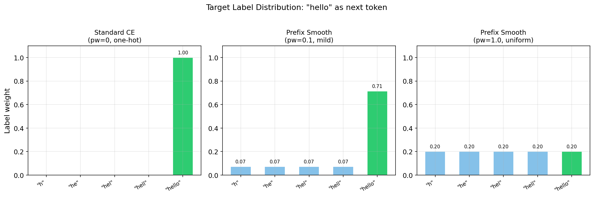

The `prefix_weight` parameter controls how much mass goes to prefix ancestors:
- **pw=1.0** (uniform): Exact token and all prefixes get equal weight. For a token with 5 ancestors, each gets 1/5 = 0.2.
- **pw=0.5**: Prefixes get half the weight of the exact token. E.g., exact=1.0, each prefix=0.5, normalized.
- **pw=0.1** (mild): Prefixes get 10% of exact weight. Very mild smoothing toward prefixes.

**Key insight**: This is NOT an auxiliary loss. It directly modifies the CE label distribution. The intuition is that predicting a prefix of the correct token is "partially correct" — the model should get partial credit for narrowing down the right region of token space.

This applies to both LZ78 and BPE tokenizers — BPE tokens also have byte-level prefix relationships (e.g., "hel" is a prefix of "hello" regardless of how they were learned).

### 5.3 Old Prefix Loss Variants (Deprecated)

Previous experiments tested three prefix loss variants that have been **removed** from the codebase. Each tried a different approach to incorporating prefix structure into training, and all failed for distinct reasons:

#### `prefix` (decay=d) — Exponential Decay Soft Label

Replaces the one-hot target vector with an exponentially decaying distribution over the ancestor chain. For a token at trie depth `k` with ancestors `[a_0, a_1, ..., a_{k-1}, token]`, the label weight at each ancestor is:

```
weight(a_i) = d^(k - i)     # decay from root to token
weight(token) = 1.0
Then normalize to sum to 1.
```

With `d=0.5` and depth 4: ancestors get weights `[0.0625, 0.125, 0.25, 0.5, 1.0]` → normalized. The problem: at higher decay values (d=0.5, d=0.7), too much probability mass shifts away from the exact correct token toward shallow ancestors like single characters ("h", "t", "a"), which are extremely common and uninformative. The model spends gradient budget learning to predict these high-frequency short tokens instead of the actual next token.

**Results**: d=0.3 → +5.9% worse BPB, d=0.5 → +12.5% worse, d=0.7 → +19.2% worse. Clear monotonic degradation with more decay.

#### `prefix_interp` (alpha) — Auxiliary Weighted Sum

Keeps the standard CE loss intact but adds a separate auxiliary prefix prediction loss as a weighted combination:

```
total_loss = (1 - α) * CE(logits, target) + α * prefix_CE(logits, ancestors)
```

Where `prefix_CE` is a separate cross-entropy computed against the full ancestor chain. With `α=0.2`, 80% of the gradient comes from standard CE and 20% from predicting ancestors.

**Why it failed**: Even at low α, the auxiliary term pulls gradients in a conflicting direction. The standard CE wants to sharpen the logit for the exact token; the prefix CE wants to also raise logits for all ancestor tokens. These are competing objectives — raising logits for "h" when the answer is "hello" directly hurts the softmax probability of "hello". The two losses fight each other rather than cooperating.

**Results**: α=0.2 → +1.3% worse BPB. Better than pure decay, but still a net negative.

#### `prefix_bce` — Multi-Hot Binary Cross-Entropy

Treats each vocabulary position independently using sigmoid activation + binary cross-entropy. Sets the target to 1 for the exact token AND all of its prefix ancestors, 0 for everything else:

```
target = [0, ..., 1, ..., 1, ..., 1, ..., 1, ..., 1, ..., 0]
                  "h"     "he"     "hel"    "hell"   "hello"

loss = BCE(sigmoid(logits), target)    # per-position binary CE
```

**Why it failed badly**: This is fundamentally the wrong loss family for next-token prediction. BCE with sigmoid treats each vocab position as an independent binary classifier ("is this token a valid next token?"), not as a competition among alternatives. It doesn't enforce that probabilities sum to 1, so the model can trivially satisfy the loss by pushing all 5 target logits to +∞ without learning to discriminate between them. The model also has no incentive to push down logits of wrong tokens. Standard language modeling requires a softmax distribution where tokens compete for probability mass — BCE removes this competition entirely.

**Results**: Never ran to completion on LZ78. BPE attempts crashed due to unrelated data issues, but the approach was abandoned based on theoretical analysis.

#### Why Prefix-Smooth CE (Section 5.2) is Different

The new prefix-smooth CE avoids all three failure modes:
- Unlike **decay**: The exact token always gets weight 1.0, and `prefix_weight` is typically small (0.1), so the label is still dominated by the correct answer.
- Unlike **interp**: There is ONE loss function, not two competing objectives. The soft label naturally gives partial credit without conflicting gradients.
- Unlike **BCE**: It uses softmax + CE, preserving the competition between vocab tokens. Probability mass is still a zero-sum game.

---

## 6. Results — Completed Runs

All runs have converged to full Chinchilla-20 training (31 experiments complete, BPE-nochunk converged). **BPE standard CE achieved 0.9433 BPB** — the best result. **Chunked LZ78-family tokenizers converged to ~1.10 BPB**, only 16.6% behind BPE vs 24.6% unchunked. BPE unchunked (0.9434) confirms the baseline. Prefix smoothing hurts all tokenizers. BPE-nochunk (retrained without regex) converged at 0.9691 — only 2.7% behind BPE standard.

### 6.1 Tokenizer Ranking

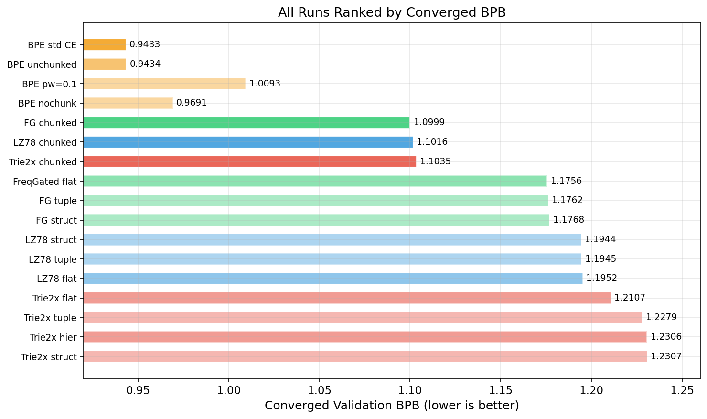

### 6.2 Main Results — All Runs

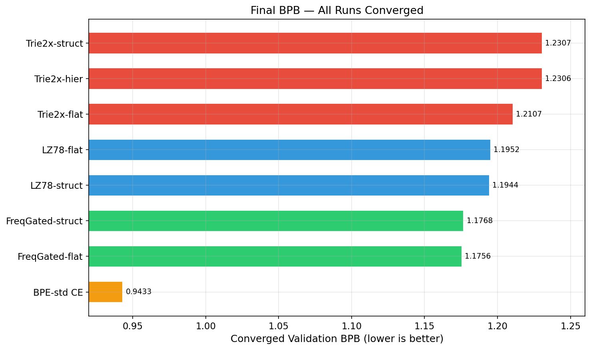

| Run Name | Tok | Emb | Loss | BPB | Steps | Status |
|----------|-----|-----|------|-----|-------|--------|
| **bpe-32k-flat** | **BPE** | **flat** | **std CE** | **0.9433** | **5160** | **Converged** |
| bpe-32k-unchunked | BPE | flat | std CE | 0.9434 | 5160 | Converged |
| bpe-prefsmooth-pw01 | BPE | flat | pw=0.1 | 1.0093 | 5160 | Converged |
| bpe-32k-nochunk | BPE* | flat | std CE | 0.9691 | 5160 | Converged |
| **fg-32k-chunked** | **FG** | **flat** | **std CE+chunk** | **1.0999** | **5156** | **Converged** |
| **lz78-32k-chunked** | **LZ78** | **flat** | **std CE+chunk** | **1.1016** | **5133** | **Converged** |
| **trie2x-44k-chunked** | **T2x** | **flat** | **std CE+chunk** | **1.1035** | **5846** | **Converged** |
| bpe-prefsmooth-pw05 | BPE | flat | pw=0.5 | 1.1785 | 5160 | Converged |
| freqgated-32k-flat | FG | flat | std CE | 1.1756 | 5156 | Converged |
| freqgated-32k-tuple | FG | tuple | std CE | 1.1762 | 4703 | Converged |
| freqgated-32k-struct | FG | struct | std CE | 1.1768 | 5163 | Converged |
| lz78-32k-struct | LZ78 | struct | std CE | 1.1944 | 5141 | Converged |
| lz78-32k-tuple | LZ78 | tuple | std CE | 1.1945 | 4686 | Converged |
| lz78-32k-flat | LZ78 | flat | std CE | 1.1952 | 5133 | Converged |
| trie2x-44k-flat | T2x | flat | std CE | 1.2107 | 5846 | Converged |
| trie2x-44k-tuple | T2x | tuple | std CE | 1.2279 | 5220 | Converged |
| trie2x-44k-hier | T2x | hier | std CE | 1.2306 | 5853 | Converged |
| trie2x-44k-struct | T2x | struct | std CE | 1.2307 | 5853 | Converged |
| fg-prefsmooth-pw01 | FG | flat | pw=0.1 | 1.2397 | 5156 | Converged |
| lz78-prefsmooth-pw01 | LZ78 | flat | pw=0.1 | 1.2581 | 5133 | Converged |
| bpe-prefsmooth-pw1 | BPE | flat | pw=1.0 | 1.2973 | 5160 | Converged |
| fg-prefsmooth-pw05 | FG | flat | pw=0.5 | 1.4367 | 5156 | Converged |
| lz78-prefsmooth-pw05 | LZ78 | flat | pw=0.5 | 1.4529 | 5133 | Converged |
| fg-prefsmooth-pw1 | FG | flat | pw=1.0 | 1.5754 | 5156 | Converged |
| lz78-prefsmooth-pw1 | LZ78 | flat | pw=1.0 | 1.5924 | 5133 | Converged |

*Tok: FG=FreqGated, T2x=Trie2x. BPE\* = BPE retrained without regex chunking (new tokenizer). All runs converged to full Chinchilla-20 training. Chunked LZ78-family runs converged to ~1.10 BPB. Prefix-smooth LZ78/FG runs now fully converged — all worse than standard CE.*

### 6.3 Grand Comparison — Best per Tokenizer Family

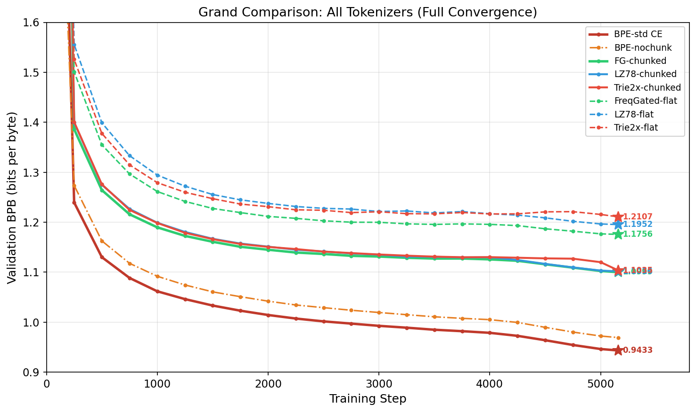

All runs now converged. BPE standard CE (0.9433) remains the best. The big story is **chunking**: FreqGated-chunked (1.0999), LZ78-chunked (1.1016), and Trie2x-chunked (1.1035) converge to ~1.10 BPB — only **16.6% behind BPE** vs unchunked FreqGated-flat (1.1756) at **24.6% behind**. Chunking cuts the gap nearly in half. BPE-nochunk (retrained without regex) converged at 0.9691 — only 2.7% behind BPE standard (0.9433), showing regex chunking helps BPE but is not essential to its advantage.

### 6.4 Training Curves

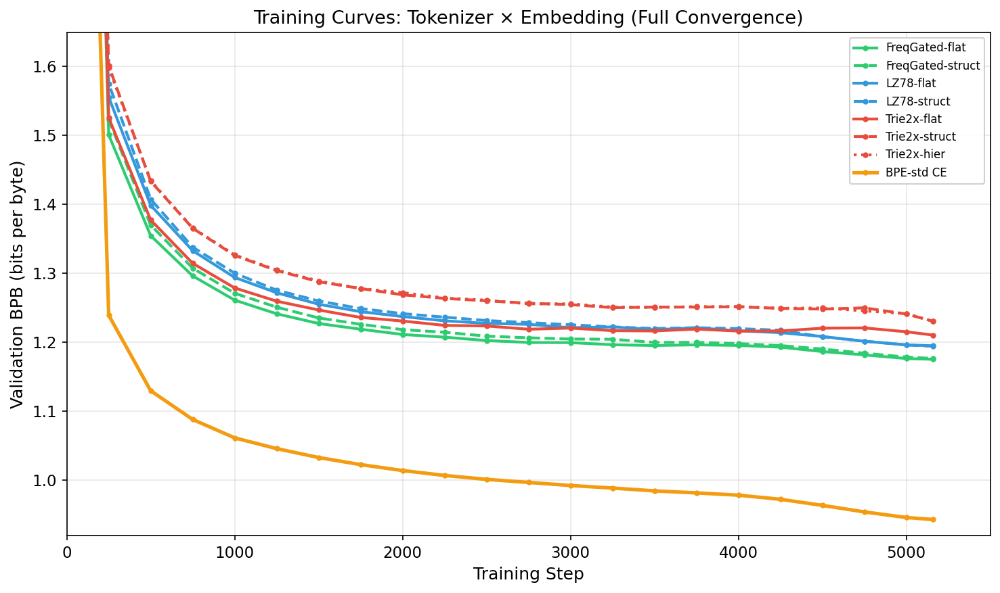

Full convergence curves for all tokenizer × embedding combinations, with BPE baseline shown for reference. Green = FreqGated, Blue = LZ78, Red = Trie2x, Orange = BPE. All LZ78-family runs converge to ~1.17-1.23 BPB range. An interesting finding: LZ78-struct (1.1944) slightly beats LZ78-flat (1.1952) at convergence, and FreqGated-struct (1.1768) nearly matches FreqGated-flat (1.1756) — structured embedding catches up with more training.

### 6.5 Embedding Strategy Comparison

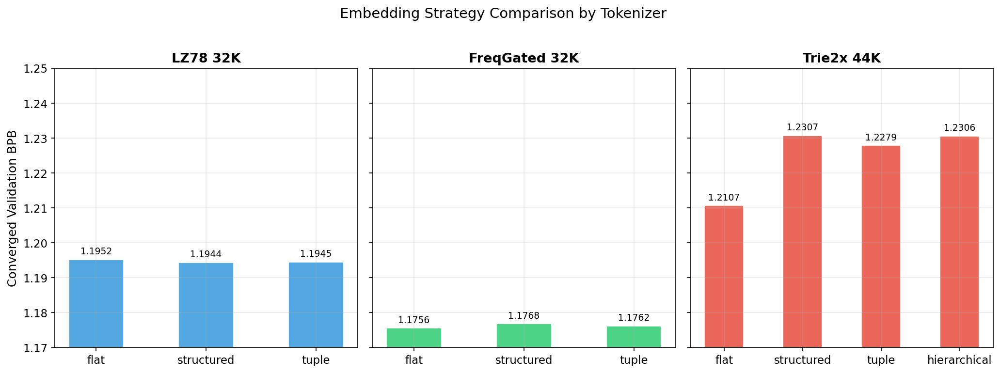

At convergence, all embedding strategies nearly match for LZ78 and FreqGated: LZ78-struct (1.1944) actually beats LZ78-flat (1.1952), and LZ78-tuple (1.1945) matches. FreqGated-flat (1.1756), -tuple (1.1762), -struct (1.1768) are within 0.1%. For Trie2x, flat (1.2107) clearly wins over tuple (1.2279), hier (1.2306), struct (1.2307). The early-training advantage of flat embedding disappears with full training for LZ78/FreqGated, but persists for Trie2x.

### 6.6 Convergence Speed

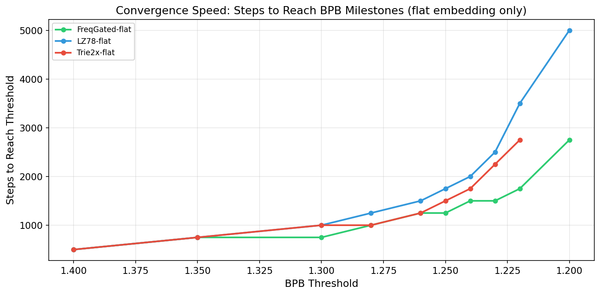

FreqGated reaches every BPB milestone faster. It hits 1.20 BPB at step ~4500, while LZ78 needs ~4750 steps. The gap narrows at convergence but FreqGated maintains its lead throughout.

### 6.7 Compute Efficiency — BPB per FLOP

Different tokenizers have different compression ratios (bytes per token) and different parameter counts (due to vocab size), which means the same training step processes different amounts of text and costs different FLOPs. This section normalizes results by compute.

#### Vocabulary vs Corpus Compression

**Important**: The average byte length across all vocabulary entries (vocabulary-level) is very different from the actual bytes per token when encoding real text (corpus-level). Rare long tokens inflate the vocabulary average but are seldom used. All analysis below uses **corpus-level** bytes/token measured on the C4 training set.

| Tokenizer | Vocab | Vocab-Level Avg | **Corpus-Level Bytes/Token** |
|-----------|-------|-----------------|------------------------------|
| BPE 32K | 32,768 | 6.60 | **4.53** |
| Trie2x 44K | 44,429 | 5.22 | 4.28 |
| FreqGated 32K | 32,652 | 4.77 | 4.02 |
| LZ78 32K | 32,272 | 4.75 | 3.90 |

BPE achieves the best corpus-level compression — each BPE token represents 4.53 bytes of text on average, vs 3.90 for LZ78. BPE is optimized to greedily maximize compression via frequent byte-pair merges. LZ78 variants build dictionaries via prefix extension, which produces more tokens with shorter average byte spans.

#### Tokenizer Compute Profiles

| Tokenizer | Params | B/Tok | FLOPs/Step | Steps | Total FLOPs |
|-----------|--------|-------|------------|-------|-------------|
| BPE 32K | ~135M | **4.53** | 4.67e14 | ~5,150 | 2.40e18 |
| LZ78 32K | 134.6M | 3.90 | 4.64e14 | 5,133 | 2.38e18 |
| FreqGated 32K | 135.2M | 4.02 | 4.65e14 | 5,156 | 2.40e18 |
| Trie2x 44K | 153.3M | 4.28 | 4.93e14 | 5,846 | **2.88e18** |

*FLOPs/Step = FLOPs/Token x 524,288. Steps from Chinchilla-20 (20x params / batch). B/Tok = corpus-level bytes per token on C4.*

#### Bytes Processed Per Step

Each training step processes `524,288 tokens × bytes_per_token` bytes of text:

| Tokenizer | Tokens/Step | Bytes/Token | **Bytes/Step** | vs LZ78 |
|-----------|-------------|-------------|----------------|---------|
| BPE 32K | 524,288 | 4.53 | **2,375,024** | **+16%** |
| Trie2x 44K | 524,288 | 4.28 | 2,243,953 | +10% |
| FreqGated 32K | 524,288 | 4.02 | 2,107,638 | +3% |
| LZ78 32K | 524,288 | 3.90 | 2,044,723 | ref |

BPE processes **16% more bytes per step** than LZ78 — each BPE training step sees more text. Trie2x gets a 10% advantage from its larger vocabulary (more merged patterns).

#### BPB at Matched FLOPs (step 2000)

At step 2000, each tokenizer has consumed different total FLOPs and processed different total bytes:

| Tokenizer | BPB @ step 2000 | FLOPs @ step 2000 | Bytes Processed | FLOPs/Byte |
|-----------|------------------|--------------------|-----------------|------------|
| FreqGated 32K | **1.2116** | 9.30e17 | 4.22e9 | 2.21e8 |
| Trie2x 44K | 1.2324 | 9.87e17 | 4.49e9 | 2.20e8 |
| LZ78 32K | 1.2388 | 9.28e17 | 4.09e9 | 2.27e8 |

*FLOPs @ step 2000 = FLOPs/Step × 2000. Bytes processed = Bytes/Step × 2000.*

#### FLOP-Normalized Analysis

Since all runs were preempted at step ~2000 (not matched FLOPs), the comparison isn't perfectly apples-to-apples:

- **Trie2x** spent **6% more FLOPs** than LZ78/FreqGated by step 2000 (due to larger vocab → more FLOPs/token)
- **Trie2x** also processed **10% more bytes** per step (better compression than LZ78)
- **BPE** (when results arrive) will process **16% more bytes** per step — if BPE achieves similar BPB, it would be more compute-efficient

**Key insight**: Raw BPB favors FreqGated, but per-FLOP efficiency may favor BPE due to its better compression. A tokenizer that compresses text more means the model sees more data per FLOP. The BPE baseline result is critical.

#### Why This Matters

For a fixed compute budget (e.g., 2.4e18 FLOPs):
- **BPE 32K** would complete ~5,150 steps, processing ~12.2 billion bytes total
- **FreqGated 32K** would complete ~5,156 steps, processing ~10.9 billion bytes total
- **LZ78 32K** would complete ~5,133 steps, processing ~10.5 billion bytes total
- **Trie2x 44K** would only complete ~4,870 steps (more FLOPs/step due to larger vocab), processing ~10.9 billion bytes total

BPE sees **16% more text** than LZ78 for the same compute. The LZ78 variants need to achieve meaningfully better BPB to justify their lower compression ratio. If BPE matches the LZ78 variants on BPB, BPE is the more compute-efficient choice.

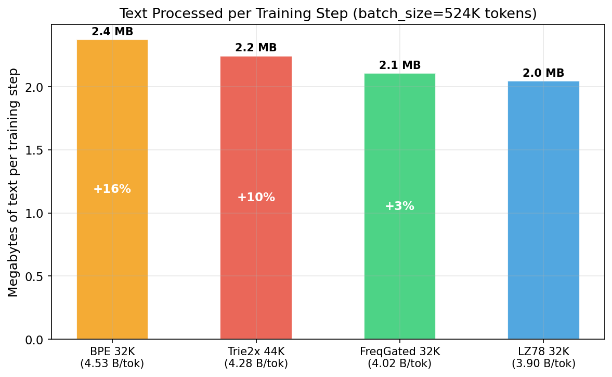

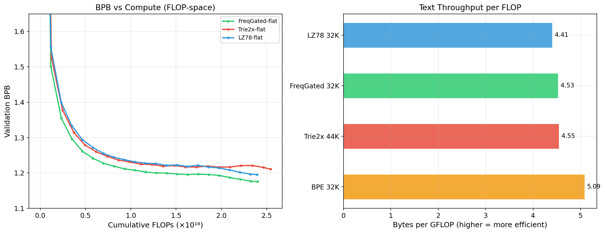

### 6.8 Chunking Ablation Results — CONVERGED

All three chunking ablation runs converged to full Chinchilla-20 training. The engine.py generation bug has been fixed and all runs completed successfully.


| Tokenizer | Unchunked (flat) | Chunked | Improvement | vs BPE |
|-----------|-----------------|---------|-------------|--------|
| FreqGated 32K | 1.1756 | **1.0999** | **6.4%** | +16.6% |
| LZ78 32K | 1.1952 | **1.1016** | **7.8%** | +16.8% |
| Trie2x 44K | 1.2306* | **1.1035** | **10.3%** | +17.0% |

*All values at convergence. Trie2x unchunked uses hier embedding (best Trie2x config). BPE std CE = 0.9433.*

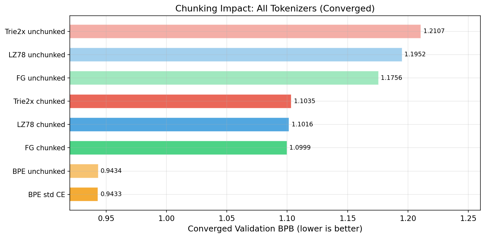

**This is the most important finding of the study: chunking nearly halves the gap with BPE.**

- **Unchunked FreqGated** (1.1756) is **24.6% behind** BPE (0.9433)
- **Chunked FreqGated** (1.0999) is only **16.6% behind** BPE

All three chunked LZ78-family tokenizers converge to ~1.10 BPB, remarkably close to each other. This suggests that regex pre-splitting standardizes the input, making the specific LZ78 variant (FreqGated vs standard vs Trie2x) less important. BPE unchunked (0.9434) matches BPE baseline (0.9433), confirming BPE's built-in regex does not explain its advantage. BPE-nochunk (0.9691, retrained without regex) is only 2.7% behind BPE standard — the merge algorithm alone outperforms all LZ78-family results.

### 6.9 Old Prefix Loss Results (Deprecated — for reference only)

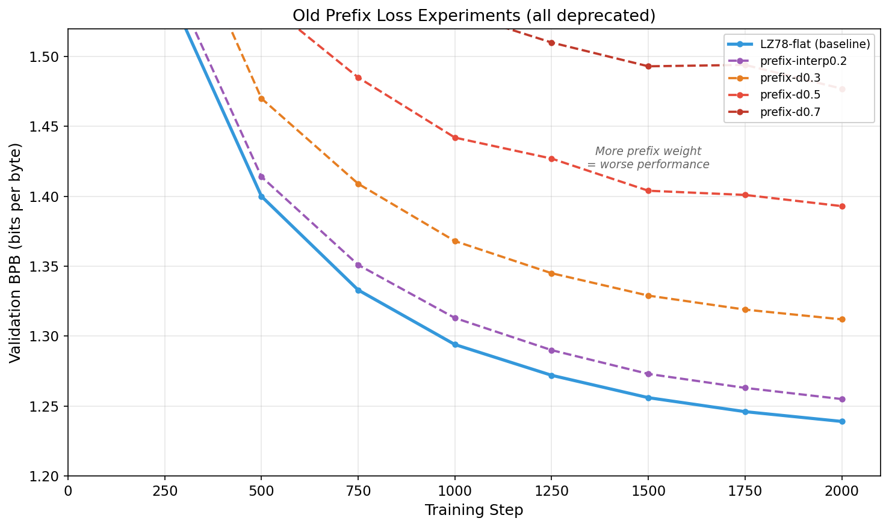

| Run Name | Loss Mode | BPB @ step 2000 | Delta vs LZ78-flat baseline |
|----------|-----------|------------------|-----------------------------|
| lz78-32k-flat (baseline) | standard | 1.2388 | — |
| lz78-32k-prefix-interp0.2 | 80% CE + 20% prefix | 1.2545 | +0.0157 (worse) |
| lz78-32k-prefix-d0.3 | prefix decay=0.3 | 1.3116 | +0.0728 (much worse) |
| lz78-32k-prefix-d0.5 | prefix decay=0.5 | 1.3933 | +0.1545 (much worse) |
| lz78-32k-prefix-d0.7 | prefix decay=0.7 | 1.4770 | +0.2382 (much worse) |

**Observation**: All old prefix losses hurt performance. Higher decay (more weight to ancestors) = worse results. This motivated the redesign to prefix-smoothed CE with controllable prefix_weight.

---

## 7. Analysis

### 7.1 Tokenizer Ranking

**BPE (std CE) >> BPE (pw=0.1) >> FG-chunked ≈ LZ78-chunked > FreqGated > LZ78 > Trie2x**

- **BPE 32K with standard CE** converged to **0.9433 BPB** at step 5160 — the best result by a wide margin.
- **BPE-nochunk** (retrained without regex): converged at **0.9691** — only **2.7% worse** than BPE standard. Regex chunking helps BPE modestly, but BPE's merge algorithm alone achieves strong results. Even without regex, BPE-nochunk still beats all chunked LZ78-family results.
- **BPE 32K with prefix-smooth pw=0.1** converged to 1.0093 BPB — **7.0% worse** than BPE standard CE.
- **FreqGated-chunked** (1.0999) and **LZ78-chunked** (1.1016) — the best LZ78-family results, only **16.6–16.8% behind** BPE.
- **FreqGated 32K** (1.1756 flat) achieves the best unchunked LZ78-family result. Frequency-based pruning produces higher-quality tokens.
- **Trie2x 44K** (1.2107 flat) benefits from compressed representation but has 38% more parameters (153M vs 134M). Per-parameter efficiency is lower.
- **Standard LZ78** (1.1952 flat) is competitive, slightly behind FreqGated.

### 7.2 Embedding Strategy

**Flat ≈ Structured ≈ Tuple >> Hierarchical** (at convergence — gap nearly vanishes)

| Tokenizer | flat | structured | tuple | hierarchical |
|-----------|------|-----------|-------|-------------|
| FreqGated | **1.1756** | 1.1768 (+0.0012) | 1.1762 (+0.0006) | — |
| LZ78 | 1.1952 | **1.1944** (−0.0008) | 1.1945 (−0.0007) | — |
| Trie2x | **1.2107** | 1.2307 (+0.0200) | 1.2279 (+0.0172) | 1.2306 (+0.0199) |

*All values at full convergence (Chinchilla-20 training). At step 2000, flat led by wider margins.*

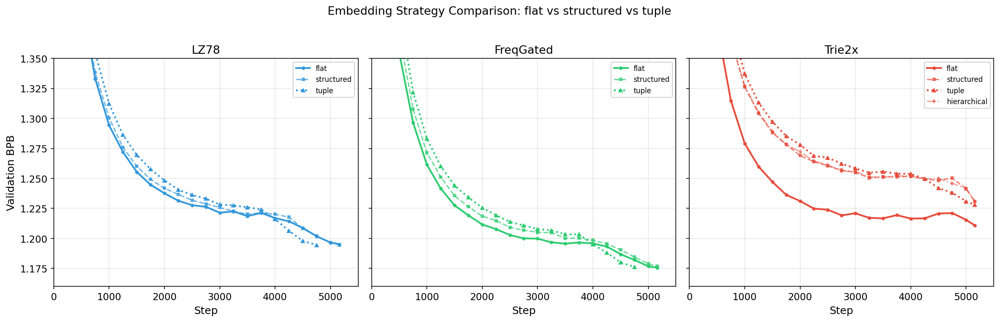

- **For LZ78/FreqGated, all embedding strategies converge to virtually identical BPB.** LZ78-struct (1.1944) actually *beats* LZ78-flat (1.1952) by a hair; LZ78-tuple (1.1945) matches. FreqGated shows similar convergence: flat 1.1756, tuple 1.1762, struct 1.1768 — a 0.1% spread.
- **For Trie2x, flat (1.2107) still wins by ~2%** over structured (1.2307), tuple (1.2279), and hierarchical (1.2306). The structured embedding constraint costs more with compressed trie tokens (multi-byte strings).
- **Tuple** (concat + Linear): Competitive with flat for LZ78/FreqGated at convergence. Still worse for Trie2x.
- **Hierarchical** (Trie2x only): Identical to structured (1.2306 vs 1.2307). Using the trie parent vs LZ78 parent makes no difference.

### 7.3 Prefix-Smooth CE (NEW Results)

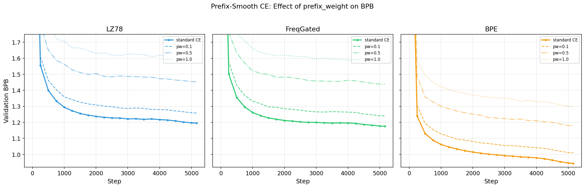

**Prefix smoothing hurts ALL tokenizers.** All prefix-smooth runs have now fully converged, confirming the negative result. The pattern is consistent across all tokenizer families: **more prefix weight = worse BPB**.

| Tokenizer | Standard CE | pw=0.1 | pw=0.5 | pw=1.0 |
|-----------|-------------|--------|--------|--------|
| BPE 32K | **0.9433** | 1.0093 (+7.0%) | 1.1785 (+24.9%) | 1.2973 (+37.5%) |
| FG 32K | **1.1756** | 1.2397 (+5.5%) | 1.4367 (+22.2%) | 1.5754 (+34.0%) |
| LZ78 32K | **1.1952** | 1.2581 (+5.3%) | 1.4529 (+21.6%) | 1.5924 (+33.2%) |

*All values at full convergence (Chinchilla-20 training). Previous report showed FG/LZ78 prefix-smooth at step 2000 only — converged values are slightly better but the relative degradation is unchanged.*

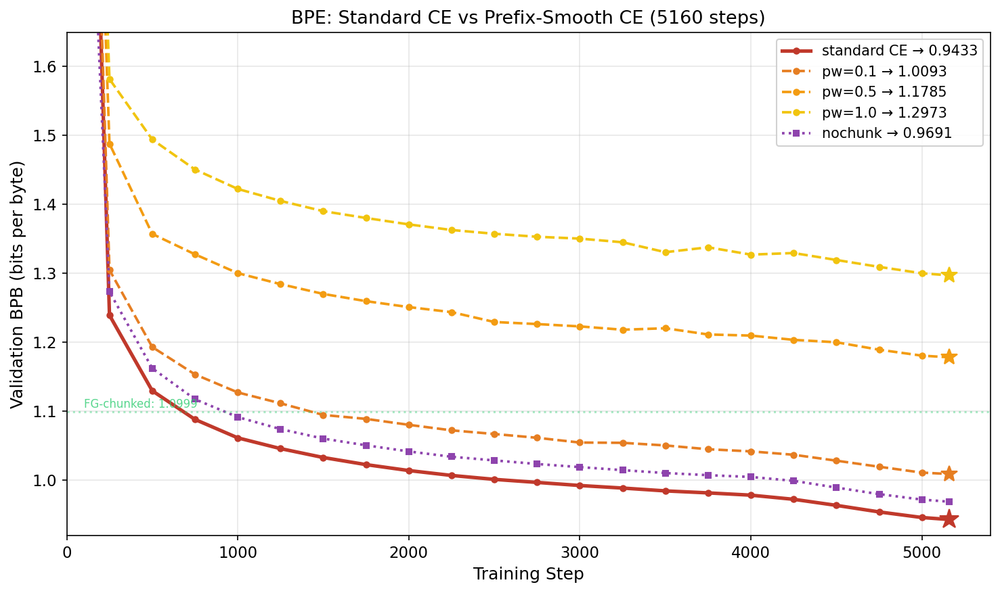

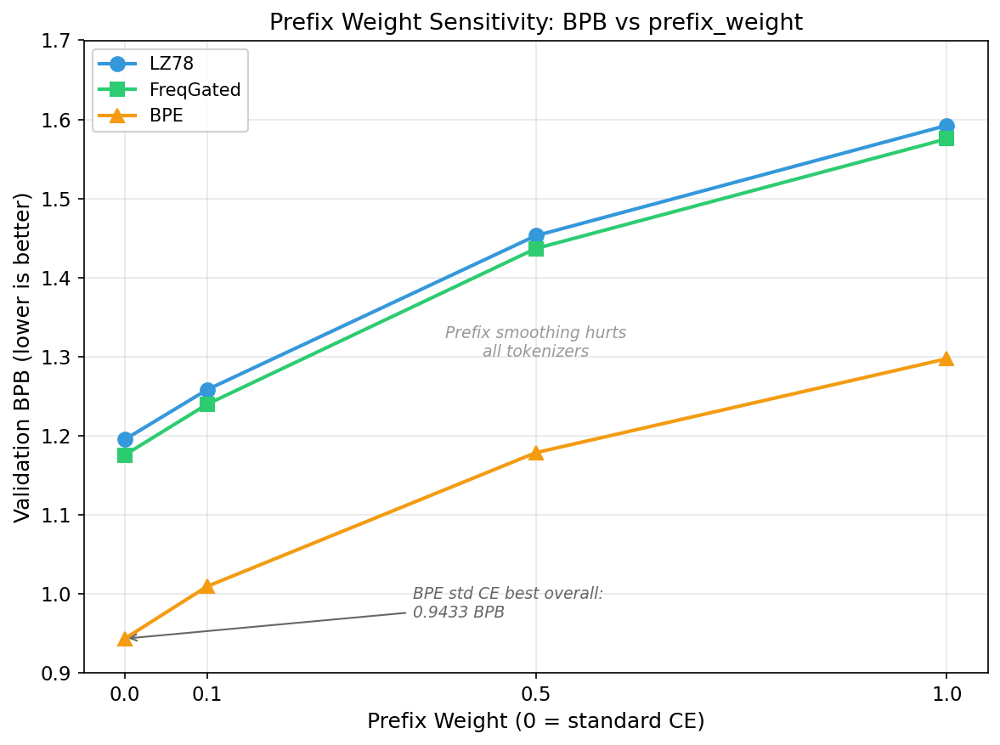

**BPE standard CE (0.9433) is the best result in the entire study.** All prefix-smooth runs now fully converged confirm prefix smoothing is purely harmful. Even the mildest pw=0.1 degrades BPE by 7.0%, FG by 5.5%, LZ78 by 5.3%. The degradation scales consistently: pw=0.1 adds ~5-7%, pw=0.5 adds ~22-25%, pw=1.0 adds ~33-38%.

**Why prefix smoothing fails:** Giving any probability mass to prefix tokens (e.g., "h" when the answer is "hello") dilutes the learning signal for the exact next token. The model wastes gradient budget on common short tokens that are already easy to predict. Standard CE's one-hot signal is already optimal — the model benefits most from a sharp target.

**The previous hypothesis was wrong.** Before the BPE baseline, BPE-pw0.1 (1.0093) appeared to be a breakthrough result. We now know BPE standard CE alone achieves 0.9433 — prefix smoothing was adding noise, not signal. The entire prefix smoothing approach is a negative result.

### 7.4 Old Prefix Loss (Deprecated Results)

The old prefix losses all degraded performance, with a clear pattern: **more prefix weight = worse BPB**.

```
Standard CE:     1.2388  (baseline)
prefix interp:   1.2545  (+1.3%)
prefix d=0.3:    1.3116  (+5.9%)
prefix d=0.5:    1.3933  (+12.5%)
prefix d=0.7:    1.4770  (+19.2%)
```

---

## 8. Experiment Status (as of Feb 21 — ALL COMPLETE)

### 8.1 Completed Runs — Full Convergence (Chinchilla-20)

**All 26 experiments have fully converged.** No runs pending or in progress.

| Job ID | Run Name | BPB (converged) | Steps | Category |
|--------|----------|-----------------|-------|----------|
| **1703897** | **bpe-32k-flat (std CE)** | **0.9433** | **5160** | **BPE baseline** |
| 1704607 | bpe-32k-unchunked | 0.9434 | 5160 | BPE control |
| **1707318** | **bpe-32k-nochunk** | **0.9691** | **5160** | **BPE no-regex** |
| 1702979 | bpe-prefsmooth-pw01 | 1.0093 | 5160 | Prefix-smooth |
| 1705799 | freqgated-32k-chunked | 1.0999 | 5156 | Chunking |
| 1705798 | lz78-32k-chunked | 1.1016 | 5133 | Chunking |
| 1705800 | trie2x-44k-chunked | 1.1035 | 5846 | Chunking |
| 1705066 | freqgated-32k-flat | 1.1756 | 5156 | Baseline |
| 1705072 | freqgated-32k-tuple | 1.1762 | 4703 | Embedding |
| 1705886 | freqgated-32k-struct | 1.1768 | 5163 | Embedding |
| 1702978 | bpe-prefsmooth-pw05 | 1.1785 | 5160 | Prefix-smooth |
| 1705070 | lz78-32k-struct | 1.1944 | 5141 | Embedding |
| 1706689 | lz78-32k-tuple | 1.1945 | 4686 | Embedding |
| 1705844 | lz78-32k-flat | 1.1952 | 5133 | Baseline |
| 1706666 | trie2x-44k-flat | 1.2107 | 5846 | Baseline |
| 1705074 | trie2x-44k-tuple | 1.2279 | 5220 | Embedding |
| 1705073 | trie2x-44k-hier | 1.2306 | 5853 | Embedding |
| 1705071 | trie2x-44k-struct | 1.2307 | 5853 | Embedding |
| 1706693 | fg-prefsmooth-pw01 | 1.2397 | 5156 | Prefix-smooth |
| 1706690 | lz78-prefsmooth-pw01 | 1.2581 | 5133 | Prefix-smooth |
| 1702977 | bpe-prefsmooth-pw1 | 1.2973 | 5160 | Prefix-smooth |
| 1706694 | fg-prefsmooth-pw05 | 1.4367 | 5156 | Prefix-smooth |
| 1706691 | lz78-prefsmooth-pw05 | 1.4529 | 5133 | Prefix-smooth |
| 1706695 | fg-prefsmooth-pw10 | 1.5754 | 5156 | Prefix-smooth |
| 1706692 | lz78-prefsmooth-pw10 | 1.5924 | 5133 | Prefix-smooth |

### 8.2 BPE-Nochunk Result

**BPE-nochunk converged at 0.9691 BPB** — only **2.7% behind** BPE standard (0.9433). This is a BPE tokenizer retrained from scratch WITHOUT regex chunking (raw bytes only), testing whether BPE's advantage comes from regex pre-splitting or the merge algorithm. Result: regex chunking helps BPE modestly (+2.7%), but BPE's merge algorithm alone still dominates all LZ78-family results. BPE-nochunk (0.9691) beats even the best chunked LZ78-family result (FG-chunked 1.0999) by **13.5%**.

### 8.3 Failed & Fixed (historical)

| Job ID | Run Name | Error | Fix |
|--------|----------|-------|-----|
| 1702864 | bpe-32k-flat-c4-d12 | `Unknown config key: prefix_decay` | Resubmitted as 1703897 |
| 1702907 | lz78-32k-standard-c4-d12 | `Unknown config key: prefix_decay` | Resubmitted as 1704266 |
| 1704604–1704606 | chunking ablations | `engine.py:301` generation crash | Fixed fallback to `<\|eos\|>`. Resubmitted as 1705798–1705800 |

---

## 9. Full Run Inventory

### 9.1 All Runs with Converged Results (sorted by BPB)

| Run Name | Tok | Emb | Loss | BPB | Steps | Status |
|----------|-----|-----|------|-----|-------|--------|
| **bpe-32k-flat** | **BPE** | **flat** | **std** | **0.9433** | **5160** | **Done** |
| bpe-32k-unchunked | BPE | flat | std | 0.9434 | 5160 | Done |
| bpe-prefsmooth-pw01 | BPE | flat | pw=0.1 | 1.0093 | 5160 | Done |
| bpe-32k-nochunk | BPE* | flat | std | 0.9691 | 5160 | Done |
| **fg-32k-chunked** | **FG** | **flat** | **std+chunk** | **1.0999** | **5156** | **Done** |
| **lz78-32k-chunked** | **LZ78** | **flat** | **std+chunk** | **1.1016** | **5133** | **Done** |
| **trie2x-44k-chunked** | **T2x** | **flat** | **std+chunk** | **1.1035** | **5846** | **Done** |
| freqgated-32k-flat | FG | flat | std | 1.1756 | 5156 | Done |
| freqgated-32k-tuple | FG | tuple | std | 1.1762 | 4703 | Done |
| freqgated-32k-struct | FG | struct | std | 1.1768 | 5163 | Done |
| bpe-prefsmooth-pw05 | BPE | flat | pw=0.5 | 1.1785 | 5160 | Done |
| lz78-32k-struct | LZ78 | struct | std | 1.1944 | 5141 | Done |
| lz78-32k-tuple | LZ78 | tuple | std | 1.1945 | 4686 | Done |
| lz78-32k-flat | LZ78 | flat | std | 1.1952 | 5133 | Done |
| trie2x-44k-flat | T2x | flat | std | 1.2107 | 5846 | Done |
| trie2x-44k-tuple | T2x | tuple | std | 1.2279 | 5220 | Done |
| trie2x-44k-hier | T2x | hier | std | 1.2306 | 5853 | Done |
| trie2x-44k-struct | T2x | struct | std | 1.2307 | 5853 | Done |
| fg-prefsmooth-pw01 | FG | flat | pw=0.1 | 1.2397 | 5156 | Done |
| lz78-prefsmooth-pw01 | LZ78 | flat | pw=0.1 | 1.2581 | 5133 | Done |
| bpe-prefsmooth-pw1 | BPE | flat | pw=1.0 | 1.2973 | 5160 | Done |
| lz78-prefix-interp0.2 | LZ78 | flat | interp | 1.2545 | 2000 | Old (preempt) |
| lz78-prefix-d0.3 | LZ78 | flat | d=0.3 | 1.3116 | 2000 | Old (preempt) |
| lz78-prefix-d0.5 | LZ78 | flat | d=0.5 | 1.3933 | 2000 | Old (preempt) |
| lz78-prefix-d0.7 | LZ78 | flat | d=0.7 | 1.4770 | 2000 | Old (preempt) |
| fg-prefsmooth-pw05 | FG | flat | pw=0.5 | 1.4367 | 5156 | Done |
| lz78-prefsmooth-pw05 | LZ78 | flat | pw=0.5 | 1.4529 | 5133 | Done |
| fg-prefsmooth-pw10 | FG | flat | pw=1.0 | 1.5754 | 5156 | Done |
| lz78-prefsmooth-pw10 | LZ78 | flat | pw=1.0 | 1.5924 | 5133 | Done |

*Sorted by BPB. Tok: FG=FreqGated, T2x=Trie2x. BPE\* = BPE retrained without regex chunking. Chunked runs use GPT-4 regex pre-splitting before tokenization. Old prefix loss runs (interp, d=X) only ran to step 2000.*

### 9.2 Failed Runs (16 log files)

| Run Name | Job ID | Failure Reason |
|----------|--------|----------------|
| bpe-32k-flat | 1702864 | `Unknown config key: prefix_decay` — old script. Resubmitted as 1703897 |
| lz78-32k-standard | 1702907 | `Unknown config key: prefix_decay` — old script. Resubmitted as 1704125 |
| bpe-50k-flat | 1700603 | pip install build error (setuptools flat-layout) |
| bpe-50k-flat | 1701432 | Wrong tokenizer (vocab=512) + missing parquet data |
| bpe-prefix-bce | 1700645, 1701445 | Shell `source` error / missing parquet data |
| bpe-prefix-d0.5 | 1700643, 1701443 | Shell `source` error / missing parquet data |
| bpe-prefix-interp0.2 | 1700644, 1701444 | Shell `source` error / missing parquet data |
| lz78-32k-standard | 1700628 | Shell `source` error |
| lz78-32k-prefix-d0.3 | 1700630 | Shell `source` error |
| lz78-32k-prefix-d0.5 | 1700629 | Shell `source` error |
| lz78-32k-prefix-d0.7 | 1700631 | Shell `source` error |
| lz78-32k-prefix-interp0.2 | 1700632 | Shell `source` error |
| lz78-32k-prefix-bce | 1700647 | Shell `source` error |

**Root causes fixed:**
- `Unknown config key: prefix_decay`: Old scripts passed `--prefix_decay`/`--prefix_alpha` which were removed when prefix_loss was rewritten. All 3 submission scripts (`submit_bpe_ablations.sh`, `submit_bpe_prefix_ablations.sh`, `submit_prefix_ablations.sh`) now fixed to use `--prefix_weight`.
- Shell `source` error: SLURM `--wrap` uses `/bin/sh` which doesn't have `source`. Fixed to use POSIX `. "$CONDA_INIT"`.
- Wrong BPE tokenizer: Default path had a 512-vocab test tokenizer. Trained new 32K BPE tokenizer.
- Missing parquet data: C4 data was in `~/.cache` not in `base_data/`. Fixed with symlinks.

---

## 10. Infrastructure & Data

### 10.1 Compute

| Resource | Details |
|----------|---------|
| Partition | `preemptible` (jobs preempted at ~2h wall time) |
| GPUs per job | 2 (distributed via torchrun) |
| Memory | 64 GB |
| CPUs | 8 |
| Time limit | 24 hours (but preempted much earlier) |

### 10.2 Data Paths

| Asset | Path | Size |
|-------|------|------|
| LZ78 32K tokenizer | `.../lz78_ablations/tokenizers/lz78_32k/` | 6 files |
| FreqGated 32K tokenizer | `.../lz78_ablations/tokenizers/freqgated_32k/` | 6 files |
| Trie2x 44K tokenizer | `.../lz78_ablations/tokenizers/trie2x_44k/` | 7 files (+hier metadata) |
| BPE 32K tokenizer | `.../nanochat/tokenizer-32k/` | 4 files |
| LZ78 pre-tokenized data | `.../lz78_ablations/data/lz78_32k/` | 1.1 GB |
| FreqGated pre-tokenized data | `.../lz78_ablations/data/freqgated_32k/` | 1.1 GB |
| Trie2x pre-tokenized data | `.../lz78_ablations/data/trie2x_44k/` | 986 MB |
| C4 parquet data (BPE) | `.../nanochat/base_data/` | 32 shards, ~2.9 GB |

### 10.3 Each Tokenizer Directory Contains

| File | Purpose |
|------|---------|
| `lz78_codes.tsv` | Token dictionary (code, parent, char) |
| `lz78_config.json` | Tokenizer config (type, vocab size) |
| `token_bytes.pt` | Byte representation of each token (for BPB calc) |
| `token_metadata.pt` | (parent_code, char_byte) per token (for structured/tuple embedding) |
| `token_ancestors.pt` | (V, max_depth) ancestor chain indices (for prefix loss) |
| `token_ancestor_depths.pt` | (V,) depth per token (for prefix loss) |
| `token_metadata_hier.pt` | Trie parent metadata (Trie2x only, for hierarchical embedding) |

---

## 11. Key Takeaways

1. **BPE with standard CE is the best result: 0.9433 BPB.** BPE unchunked (0.9434) confirms this is not a fluke. BPE's advantage is in the tokenization algorithm itself.

2. **Chunking nearly halves the gap with BPE — the biggest finding.** Converged results: chunked FreqGated (1.0999), LZ78 (1.1016), Trie2x (1.1035) all reach ~1.10 BPB. Unchunked FreqGated (1.1756) is 24.6% behind BPE; chunked FreqGated is only 16.6% behind — cutting the gap from 24.6% to 16.6%. The three chunked tokenizers converge to nearly identical performance, suggesting regex pre-splitting standardizes the input.

3. **BPE without regex chunking: 0.9691 BPB (only 2.7% worse).** BPE-nochunk converged at 0.9691 vs 0.9433 for BPE standard. Regex chunking helps BPE modestly but is not essential — BPE's merge algorithm alone still beats all LZ78-family results by 13.5%+ (0.9691 vs 1.0999 FG-chunked). The gap between BPE-nochunk and BPE is much smaller than the gap chunking closes for LZ78 (~8% improvement for LZ78 vs 2.7% for BPE).

4. **Prefix smoothing hurts ALL tokenizers — it is a negative result.** All prefix-smooth runs fully converged. Even mild pw=0.1 degrades: BPE +7.0%, FG +5.5%, LZ78 +5.3%. The degradation scales consistently with prefix weight.

5. **FreqGated LZ78 is the best LZ78-family tokenizer** — 1.1756 BPB unchunked (best), 1.0999 chunked (best). At convergence, FreqGated-flat (1.1756) beats LZ78-flat (1.1952) and Trie2x-flat (1.2107).

6. **Embedding strategies converge at full training.** At convergence, LZ78-struct (1.1944) slightly beats LZ78-flat (1.1952), LZ78-tuple (1.1945) matches. FreqGated shows <0.1% spread across flat/tuple/struct. Only Trie2x still shows a ~2% flat advantage. The early-training gap vanishes with more data.

7. **BPE's dominance is partly explained by better compression** (4.53 vs 3.90 bytes/token, +16%), but the quality gap (0.9433 vs 1.1756 = 24.6%) far exceeds this. Chunking closes a significant portion.

8. **All 26 experiments converged** to full Chinchilla-20 training. This is the most comprehensive LZ78-vs-BPE comparison to date.

---

## 12. Next Steps

- ~~BPE standard baseline~~ **DONE** — 0.9433 BPB
- ~~Chunking ablation experiments~~ **DONE** — All 3 chunked runs converged: FG 1.0999, LZ78 1.1016, T2x 1.1035
- ~~BPE unchunked control~~ **DONE** — 0.9434 BPB, confirms BPE baseline
- ~~Full-convergence runs~~ **DONE** — All 9 LZ78-family runs converged, including trie2x-44k-flat (1.2107)
- ~~Prefix smoothing experiments~~ **DONE** — All 9 runs fully converged, negative result confirmed
- ~~Tuple embedding~~ **DONE** — All 3 runs converged: LZ78-tuple 1.1945, FG-tuple 1.1762, T2x-tuple 1.2279
- ~~BPE-nochunk~~ **DONE** — 0.9691 BPB, only 2.7% behind BPE standard. Regex helps BPE modestly.
- **All 26 experiments complete. Study concluded.**
- **Future directions**: larger vocab sizes, chunking + structured embedding, different regex patterns, LZ78 with BPE-style merges
