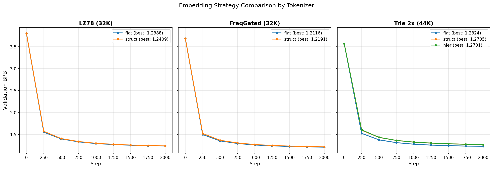
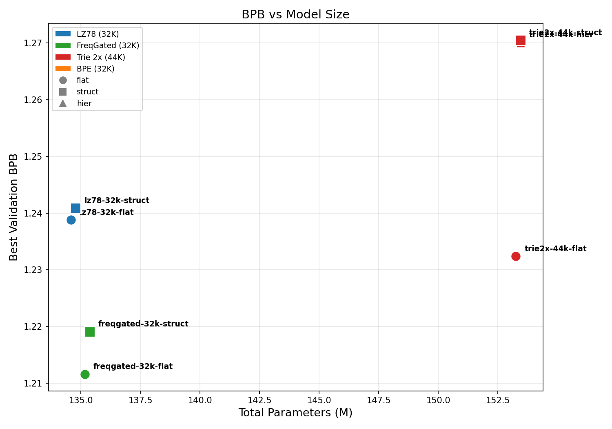
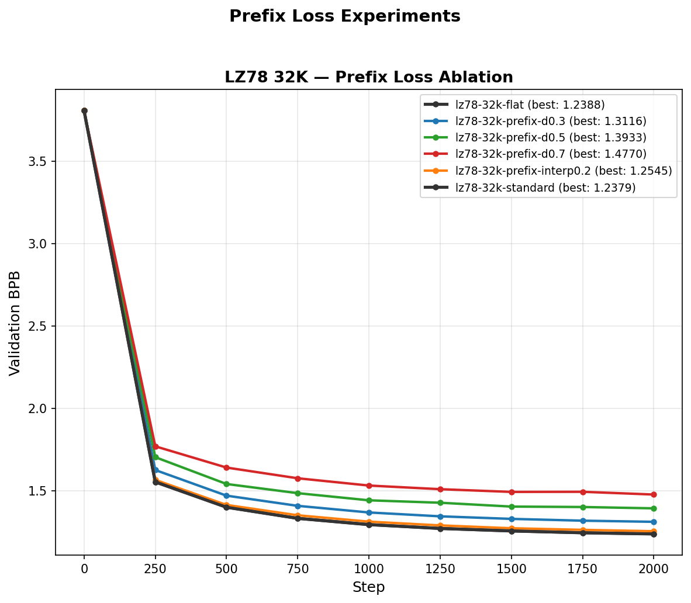
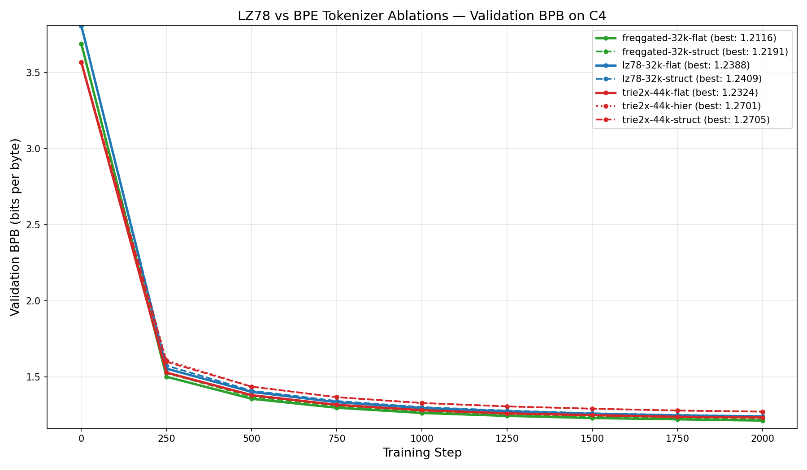
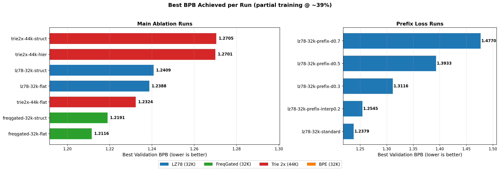
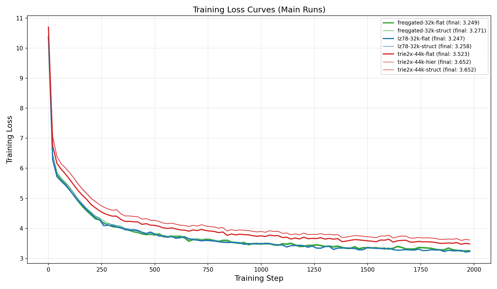
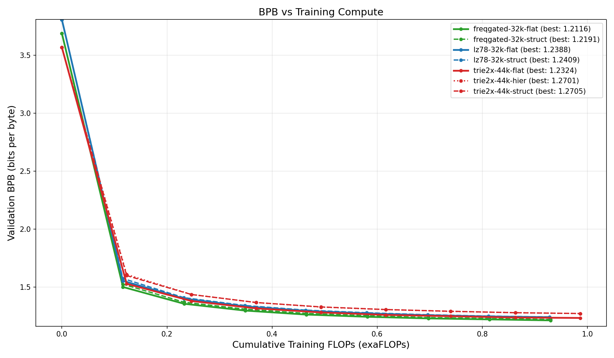

# LZ78 vs BPE Tokenizer Ablation Results

## 1. What is this experiment?

We are comparing **LZ78-based tokenizers** against the standard **BPE tokenizer** for training GPT language models. The question: can a dictionary-based compression algorithm (LZ78) produce tokenizations that work as well as (or better than) the industry-standard BPE?

We also test two additional ideas:
- **Embedding strategies**: Since LZ78 tokens have a tree structure (each token = parent token + one new character), can we exploit that structure in the embedding layer?
- **Prefix loss**: Since LZ78 tokens share prefixes, can we add an auxiliary loss that rewards the model for predicting not just the exact token, but also its prefix ancestors?

---

## 2. Tokenizer Types Explained

### LZ78 (Normal) — `lz78-32k`
- **Vocab: 32,272 tokens**
- Standard LZ78 compression algorithm. Reads text left-to-right, building a dictionary prefix tree. Each new entry = the longest existing match + one new byte.
- The dictionary fills up fast (~200KB of text fills 32K entries), so it only sees a tiny fraction of the training data.
- Each token is identified by `(parent_code, character)` — e.g., token "the" = token "th" + 'e'.

### Frequency-Gated LZ78 — `freqgated-32k`
- **Vocab: 32,652 tokens**
- Same algorithm as LZ78, but with a key improvement: **periodically evicts rare/low-frequency entries** from the dictionary during construction.
- This means the dictionary processes ALL of the C4 training data (~1GB), not just the first 200KB.
- The result is a curated dictionary of the 32K most useful entries — like BPE but using LZ78's tree structure.

### Compressed Trie (Patricia Trie) — `trie2x-44k`
- **Vocab: 44,429 tokens**
- Takes the LZ78 trie and **compresses single-child chains** into single nodes with multi-character edge labels (a "Patricia trie").
- "2x" means the base dictionary was 2x the target size before compression. The result has 44K entries (larger than the 32K LZ78 variants).
- Larger vocab = more embedding parameters = potentially less fair comparison.

### BPE (Byte-Pair Encoding) — `bpe-32k`
- **Vocab: 32,768 tokens**
- Industry-standard tokenizer (used by GPT-4, LLaMA, etc.). Iteratively merges the most frequent byte pairs.
- Trained on the same C4 data. **This is the baseline** we're comparing against.
- **Status: PENDING** — previous runs crashed due to data path issues (now fixed). Resubmitted.

---

## 3. Embedding Strategies Explained

Each LZ78 token has a tree structure: token "the" is the child of token "th", which is the child of token "t". We test three ways to embed these tokens:

### Flat (`-flat`)
Standard embedding. Each token gets its own independent learned vector: `embedding = Embedding[token_id]`. Ignores the tree structure entirely.

### Structured (`-struct`)
Decomposes each token into its parent code and new character, and sums their embeddings: `embedding = ParentEmbed[parent_code] + CharEmbed[character]`. Tokens sharing the same parent get related embeddings. Uses fewer parameters.

### Hierarchical (`-hier`)
Walks up the full trie ancestor chain and sums embeddings from all ancestors: `embedding = sum(AncestorEmbed[ancestor] for ancestor in chain)`. The deepest sharing of parameters.

---

## 4. Loss Functions Explained

### Standard CE (`standard` / `flat`)
Normal cross-entropy loss: predict the next token from the full vocabulary. The standard approach.

### Prefix Loss (`prefix-d{decay}`)
Instead of only rewarding the model for predicting the exact next token, also give partial credit for predicting any **prefix ancestor** of that token. The `decay` parameter controls how much credit: `weight(ancestor) = decay^depth`.
- **decay=0.3** (prefix-d0.3): Most weight on the exact token, little on ancestors
- **decay=0.5** (prefix-d0.5): Balanced
- **decay=0.7** (prefix-d0.7): Significant weight on ancestors

### Prefix Interpolation (`prefix-interp0.2`)
Blend of standard CE and prefix loss: `loss = (1-α) * CE + α * prefix_loss` where α=0.2. A softer version of pure prefix loss.

### Prefix BCE (`prefix-bce`)
Binary cross-entropy version of prefix loss, applied independently to each ancestor.

---

## 5. Model Configuration

All runs share the same model architecture:
- **Architecture**: GPT (decoder-only transformer)
- **Depth**: 12 layers (`n_layer=12`)
- **Model dim**: 768 (`n_embd=768`)
- **Attention heads**: 6 (`n_head=6`, head_dim=128)
- **MLP**: relu^2 activation, hidden_dim=3072 (4x expansion)
- **Embeddings**: Untied (separate wte and lm_head)
- **Vocab padding**: Padded to nearest multiple of 64

Training:
- **Data ratio**: Chinchilla-20 (20x params in training tokens)
- **Optimizer**: Muon (for attention/MLP matrices) + AdamW (for embeddings)
- **Batch size**: 524,288 tokens
- **GPUs**: 2x A100 (SLURM preemptible partition)
- **Data**: C4 (FineWeb-Edu 100B subset, 32 parquet shards)

---

## 6. Results

**All runs were preempted at ~39% training (step ~2000 of ~5100).** Results are preliminary but the relative ordering is consistent and informative.

### 6.1 Main Ablation — All Runs Ranked by BPB

| Rank | Run Name | BPB | Params | Vocab | Description |
|------|----------|-----|--------|-------|-------------|
| 1 | **freqgated-32k-flat** | **1.2116** | 135.2M | 32,652 | FreqGated tokenizer, flat embedding |
| 2 | freqgated-32k-struct | 1.2191 | 135.4M | 32,652 | FreqGated tokenizer, structured embedding |
| 3 | trie2x-44k-flat | 1.2324 | 153.3M | 44,429 | Compressed trie, flat embedding |
| 4 | lz78-32k-standard | 1.2379 | 134.6M | 32,272 | Normal LZ78, standard CE (control) |
| 5 | lz78-32k-flat | 1.2388 | 134.6M | 32,272 | Normal LZ78, flat embedding |
| 6 | lz78-32k-struct | 1.2409 | 134.8M | 32,272 | Normal LZ78, structured embedding |
| 7 | trie2x-44k-struct | 1.2705 | 153.5M | 44,429 | Compressed trie, structured embedding |
| 8 | trie2x-44k-hier | 1.2701 | 153.5M | 44,429 | Compressed trie, hierarchical embedding |
| — | **bpe-32k-flat** | **pending** | ~134M | 32,768 | BPE baseline (in SLURM queue) |

### 6.2 Prefix Loss Experiments

| Rank | Run Name | BPB | Loss Mode | Description |
|------|----------|-----|-----------|-------------|
| 1 | lz78-32k-standard | 1.2379 | standard CE | Baseline control |
| 2 | lz78-32k-flat | 1.2388 | standard CE | Same as above (different log) |
| 3 | lz78-32k-prefix-interp0.2 | 1.2545 | 80% CE + 20% prefix | Best prefix variant |
| 4 | lz78-32k-prefix-d0.3 | 1.3116 | prefix (decay=0.3) | Low decay |
| 5 | lz78-32k-prefix-d0.5 | 1.3933 | prefix (decay=0.5) | Medium decay |
| 6 | lz78-32k-prefix-d0.7 | 1.4770 | prefix (decay=0.7) | High decay (worst) |

---

## 7. Key Findings

### Finding 1: FreqGated LZ78 is the best LZ78 variant
FreqGated-32k-flat achieves **1.2116 BPB**, beating all other LZ78 variants. The frequency-gated eviction mechanism produces a higher-quality dictionary by seeing all the training data and keeping only the most useful entries, rather than filling up on the first 200KB like standard LZ78.

### Finding 2: Flat embedding always wins
Across every tokenizer type, the simple flat embedding outperforms structured and hierarchical:
- **LZ78**: flat (1.2388) > struct (1.2409) — small gap (0.17%)
- **FreqGated**: flat (1.2116) > struct (1.2191) — small gap (0.62%)
- **Trie2x**: flat (1.2324) >> struct (1.2705) >> hier (1.2701) — large gap (3.1%)

The structured/hierarchical embeddings constrain the model by forcing parameter sharing across related tokens. While this seems elegant, the model learns better representations when each token gets its own independent embedding vector.

The gap is especially large for Trie2x because the compressed trie's multi-character edge labels make the `(parent, char)` decomposition less meaningful.



### Finding 3: Trie2x is parameter-inefficient
Trie2x has 13% more parameters (153M vs 135M) due to its larger 44K vocab, yet trie2x-flat (1.2324) is worse than freqgated-flat (1.2116) which has fewer parameters. On a per-FLOP basis, trie2x is the least efficient tokenizer.



### Finding 4: Prefix loss hurts performance
Every prefix loss variant performs **worse** than standard CE:
- prefix-interp0.2: 1.2545 (+1.3% worse than standard 1.2379)
- prefix-d0.3: 1.3116 (+6.0%)
- prefix-d0.5: 1.3933 (+12.6%)
- prefix-d0.7: 1.4770 (+19.3%)

Higher decay values spread more probability mass to prefix ancestors, and this consistently hurts. The learning signal is diluted: instead of learning "the next token is definitely X", the model learns "the next token is probably something that starts like X". This is a weaker supervisory signal.

The interpolation approach (80% CE + 20% prefix) is the least harmful because it preserves most of the standard CE signal.



### Finding 5: BPE comparison is the critical missing piece
We don't yet know if LZ78 outperforms BPE. The BPE baseline crashed in all previous attempts due to:
1. Missing C4 data at the expected path (fixed: symlinked 32 parquet shards)
2. Wrong tokenizer (a 512-vocab test tokenizer was in the default path; fixed: trained a proper 32K BPE tokenizer)

The BPE-32K baseline is now in the SLURM queue with all issues resolved.

---

## 8. All Plots

### BPB Comparison — All Main Runs
Shows validation BPB over training steps for all tokenizer/embedding combinations. FreqGated (green) leads throughout training.


### BPB by Tokenizer — Embedding Strategy Comparison
Each panel isolates one tokenizer type to compare flat vs structured vs hierarchical. Flat wins in every panel.


### Best BPB Bar Chart
Ranked bar chart of best BPB achieved. Left panel: main ablation. Right panel: prefix loss experiments.


### Training Loss Curves
Raw training loss (not BPB) over time. Trie2x starts higher due to larger vocab (higher initial entropy).


### BPB vs Training FLOPs
Same data as the BPB comparison but with x-axis as cumulative FLOPs instead of steps. Shows compute efficiency.


### BPB vs Model Size
Scatter plot: each point is a run, x=total params, y=best BPB. FreqGated achieves the best BPB with fewer parameters than Trie2x.


### Prefix Loss Experiments
BPB curves for all prefix loss variants on LZ78-32K. Standard CE (black) clearly beats all prefix variants.


---

## 9. Complete Run Inventory

### Every Run — What It Is and Current Status

| # | Run Name | Tokenizer | Embedding | Loss | Status | Best BPB |
|---|----------|-----------|-----------|------|--------|----------|
| 1 | `lz78-32k-flat-c4-d12` | Normal LZ78 (32K) | flat | standard CE | preempted @ 39%, resubmitted | 1.2388 |
| 2 | `lz78-32k-struct-c4-d12` | Normal LZ78 (32K) | structured | standard CE | preempted @ 39%, resubmitted | 1.2409 |
| 3 | `freqgated-32k-flat-c4-d12` | FreqGated LZ78 (32K) | flat | standard CE | preempted @ 39%, resubmitted | **1.2116** |
| 4 | `freqgated-32k-struct-c4-d12` | FreqGated LZ78 (32K) | structured | standard CE | preempted @ 39%, resubmitted | 1.2191 |
| 5 | `trie2x-44k-flat-c4-d12` | Compressed Trie (44K) | flat | standard CE | preempted @ 39%, resubmitted | 1.2324 |
| 6 | `trie2x-44k-struct-c4-d12` | Compressed Trie (44K) | structured | standard CE | preempted @ 39%, resubmitted | 1.2705 |
| 7 | `trie2x-44k-hier-c4-d12` | Compressed Trie (44K) | hierarchical | standard CE | preempted @ 39%, resubmitted | 1.2701 |
| 8 | `bpe-32k-flat-c4-d12` | BPE (32K) | flat | standard CE | **pending (NEW)** | — |
| 9 | `lz78-32k-standard-c4-d12` | Normal LZ78 (32K) | flat | standard CE | preempted @ 39%, resubmitted | 1.2379 |
| 10 | `lz78-32k-prefix-d0.3-c4-d12` | Normal LZ78 (32K) | flat | prefix (decay=0.3) | preempted @ 39%, resubmitted | 1.3116 |
| 11 | `lz78-32k-prefix-d0.5-c4-d12` | Normal LZ78 (32K) | flat | prefix (decay=0.5) | preempted @ 39%, resubmitted | 1.3933 |
| 12 | `lz78-32k-prefix-d0.7-c4-d12` | Normal LZ78 (32K) | flat | prefix (decay=0.7) | preempted @ 39%, resubmitted | 1.4770 |
| 13 | `lz78-32k-prefix-interp0.2-c4-d12` | Normal LZ78 (32K) | flat | 80% CE + 20% prefix | preempted @ 39%, resubmitted | 1.2545 |
| 14 | `bpe-32k-prefix-d0.5-c4-d12` | BPE (32K) | flat | prefix (decay=0.5) | **pending (NEW)** | — |
| 15 | `bpe-32k-prefix-interp0.2-c4-d12` | BPE (32K) | flat | 80% CE + 20% prefix | **pending (NEW)** | — |
| 16 | `bpe-32k-prefix-bce-c4-d12` | BPE (32K) | flat | prefix BCE | **pending (NEW)** | — |

---

## 10. Issues Found and Fixed

### Issue 1: BPE data path mismatch
The training code expected C4 parquet files at `/large_storage/goodarzilab/parsaidp/nanochat/base_data/` but they were only in `~/.cache/nanochat/base_data/`. Fixed by creating symlinks (32 shards, 2.9GB total).

### Issue 2: Wrong BPE tokenizer (512 vocab!)
The default `tokenizer.pkl` at the expected path was a tiny 512-vocab test tokenizer, not the expected ~50K BPE. The model was training with `Vocab size: 512` and 85M params — essentially a byte-level model. Fixed by training a proper 32K BPE tokenizer on C4 (4 minutes) to match LZ78's vocab size.

### Issue 3: SLURM `source` vs `.` in --wrap
SLURM's `--wrap` runs commands in `/bin/sh` (not bash). `source` is a bash builtin and fails in sh. Fixed by replacing `source "$CONDA_INIT"` with `. "$CONDA_INIT"` (POSIX compatible).

### Issue 4: Missing ancestor data for BPE prefix loss
BPE prefix experiments need `token_ancestors.pt` mapping each BPE token to its byte-level prefix ancestors. Generated using `scripts/bpe_generate_ancestors.py` which builds a trie from all BPE token byte sequences.

---

## 11. Reproduction

```bash
# 1. Train 32K BPE tokenizer (4 minutes on CPU)
python -m scripts.tok_train --vocab_size=32768 --tokenizer_dir=tokenizer-32k

# 2. Generate BPE ancestor data for prefix loss experiments
python -m scripts.bpe_generate_ancestors --tokenizer_dir /large_storage/goodarzilab/parsaidp/nanochat/tokenizer-32k

# 3. Submit all LZ78 ablation runs (pretokenize + train)
bash scripts/submit_lz78_ablations.sh

# 4. Submit BPE runs (pass tokenizer training job ID for dependency)
bash scripts/submit_bpe_ablations.sh [TOK_TRAIN_JOBID]

# 5. Submit LZ78 prefix loss experiments
bash scripts/submit_prefix_ablations.sh

# 6. Generate all plots
python scripts/plot_results.py
```

---

## 12. Run Naming Convention

Format: `{tokenizer}-{vocab}-{embedding/loss}-c4-d12`

| Part | Meaning | Example |
|------|---------|---------|
| `lz78-32k` | Normal LZ78 tokenizer, ~32K vocab | |
| `freqgated-32k` | Frequency-gated LZ78, ~32K vocab | |
| `trie2x-44k` | Compressed trie, ~44K vocab | |
| `bpe-32k` | BPE, 32K vocab | |
| `-flat` | Flat embedding (standard) | `lz78-32k-flat` |
| `-struct` | Structured embedding (parent+char) | `lz78-32k-struct` |
| `-hier` | Hierarchical embedding (full ancestor chain) | `trie2x-44k-hier` |
| `-standard` | Standard CE loss (control run) | `lz78-32k-standard` |
| `-prefix-d0.X` | Prefix loss with decay=0.X | `lz78-32k-prefix-d0.5` |
| `-prefix-interp0.2` | 80% CE + 20% prefix loss | `lz78-32k-prefix-interp0.2` |
| `-prefix-bce` | Prefix BCE loss | `bpe-32k-prefix-bce` |
| `c4` | Trained on C4 (FineWeb-Edu) | |
| `d12` | Depth=12 (n_layer=12, n_embd=768) | |
